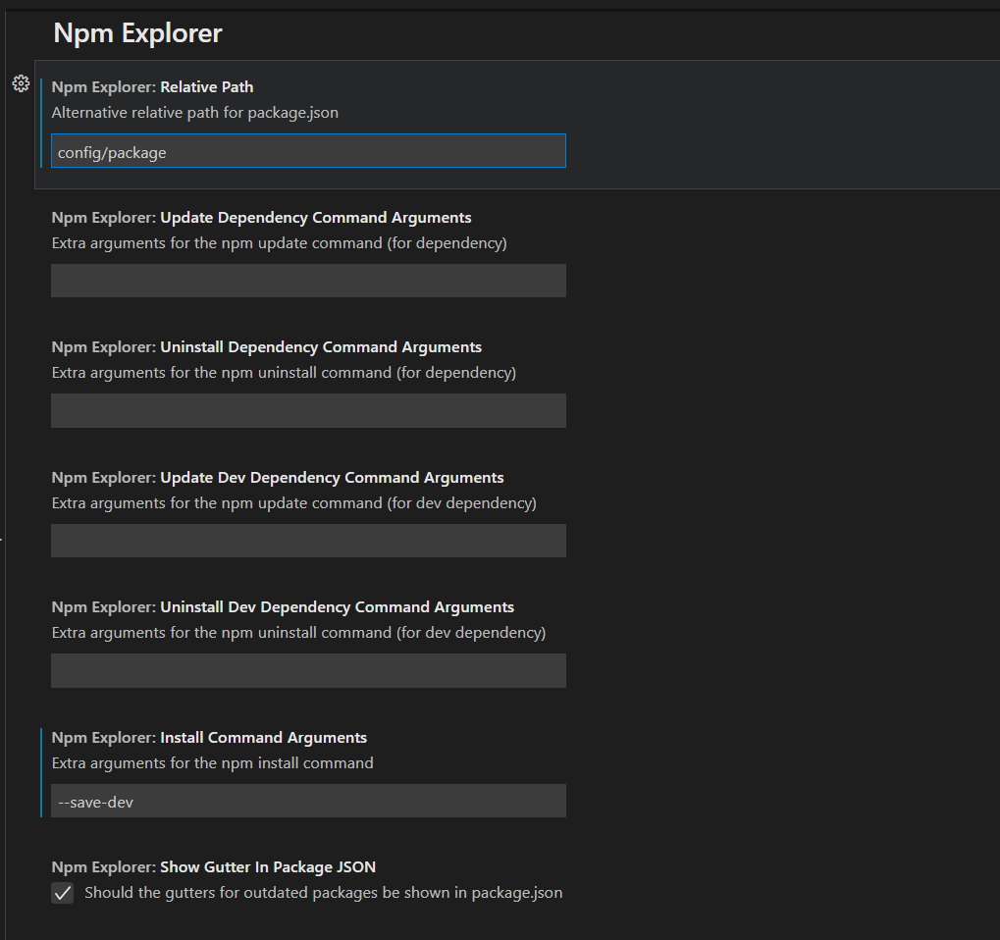

# Npm Explorer

## Description

This extension adds a new view in the explorer that shows npm tasks, dependencies and dev dependencies. Actions are provided for editing, deleting, running a task and editing, deleting, updating, uninstalling a dependency. There are view actions to refresh the tree or show outdated dependencies.

 

## Configuration

These settings are probably better used as workspace settings instead of user settings, especially the alternative path as it depends on the workspace.

- Relative path: in case the workspace is not open on the directory containing the package.json specify the relative path (if not the extension looks for package.json on the root directory of the workspace)
- Update Dependency Command Arguments: extra arguments to be passed to ``npm update`` (for dependency)
- Uninstall Dependency Command Arguments: extra arguments to be passed to ``npm uninstall`` (for dependency)
- Update Dev Dependency Command Arguments: extra arguments to be passed to ``npm update`` (for dev dependency, if empty the command will run with --save-dev)
- Uninstall Dev Dependency Command Arguments: extra arguments to be passed to ``npm uninstall`` (for dev dependency, if empty the command will run with --save-dev)
- Install Command Arguments: extra arguments to be passed to ``npm install``

 

## License

This project is licensed under the [MIT License](LICENSE).