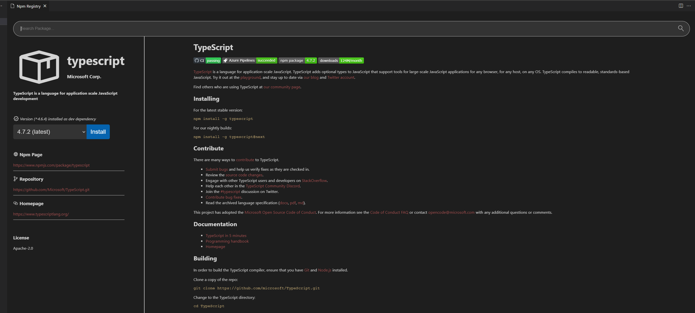

# Npm Explorer

## Description

This extension adds a new view in the explorer that shows npm tasks, dependencies and dev dependencies. Actions are provided for editing, deleting, running a task and editing, deleting, updating, uninstalling a dependency. There are view actions to refresh the tree or show outdated dependencies.

 

The extension offers also a webview to search the npm registry for packages, install directly from there or install different versions of the existing packages, either as production or development dependencies.
 The webview can be triggered:
- From an existing dependency directly (opens the page of this dependency)
- From the general actions (opens a page to search for packages)

 

The extension also marks the outdated dependencies in the package.json in a non-intrusive way, by marking the lines and not the text or the file itself. This can be disabled in the settings in case a more aggressive way to indicate the packages is desired (there are plenty extensions that mark the lines and/or the file)

 

## Configuration

These settings are probably better used as workspace settings instead of user settings, especially the alternative path as it depends on the workspace.

- Relative path: in case the workspace is not open on the directory containing the package.json specify the relative path (if not the extension looks for package.json on the root directory of the workspace)
- Update Dependency Command Arguments: extra arguments to be passed to ``npm update`` (for dependency)
- Uninstall Dependency Command Arguments: extra arguments to be passed to ``npm uninstall`` (for dependency)
- Update Dev Dependency Command Arguments: extra arguments to be passed to ``npm update`` (for dev dependency, if empty the command will run with --save-dev)
- Uninstall Dev Dependency Command Arguments: extra arguments to be passed to ``npm uninstall`` (for dev dependency, if empty the command will run with --save-dev)
- Install Command Arguments: extra arguments to be passed to ``npm install``
- Show Gutter In Package JSON: should outdated packages be indicated as such in package.json

 

## License

This project is licensed under the [MIT License](LICENSE).